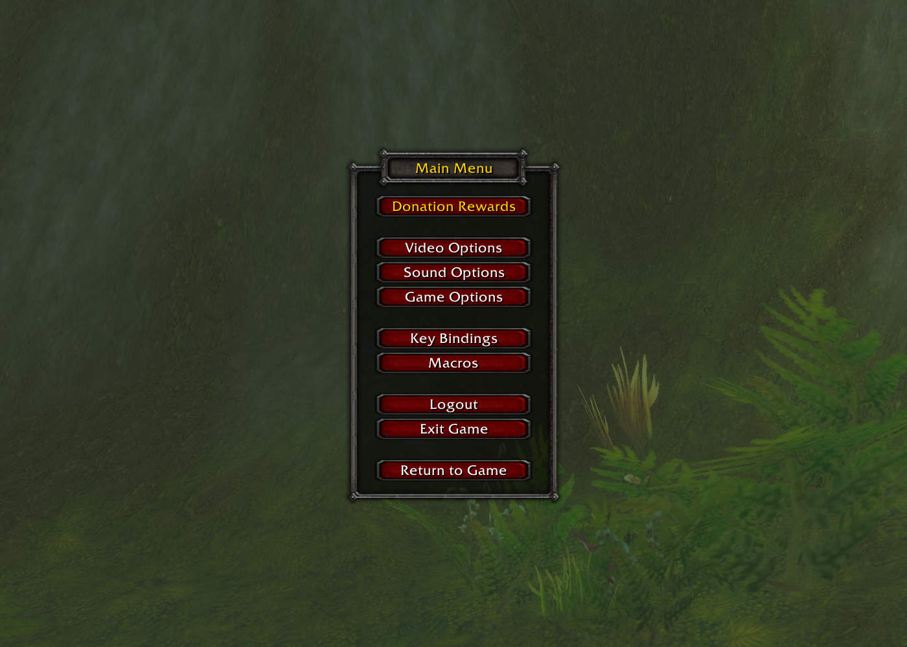
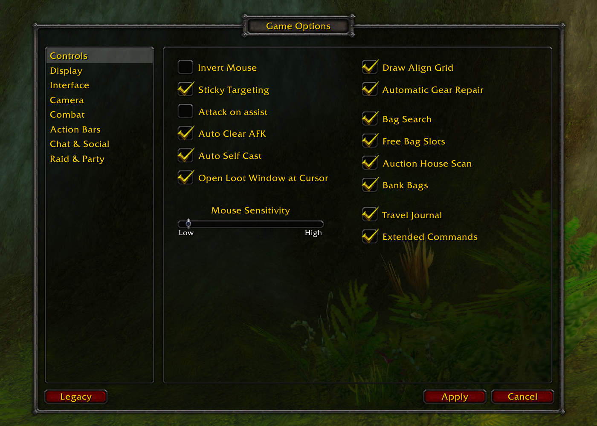
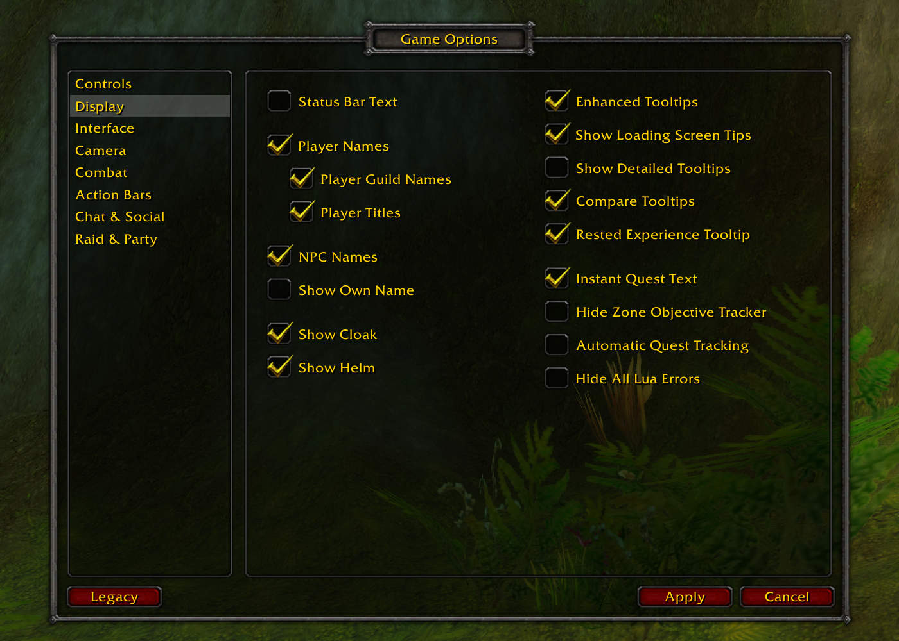
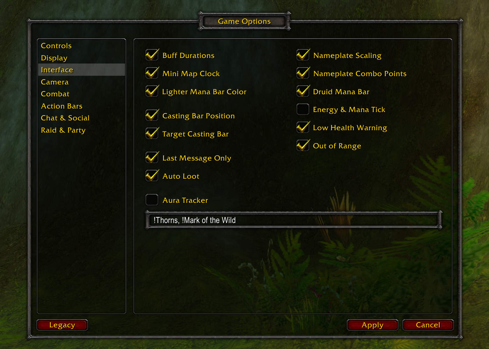
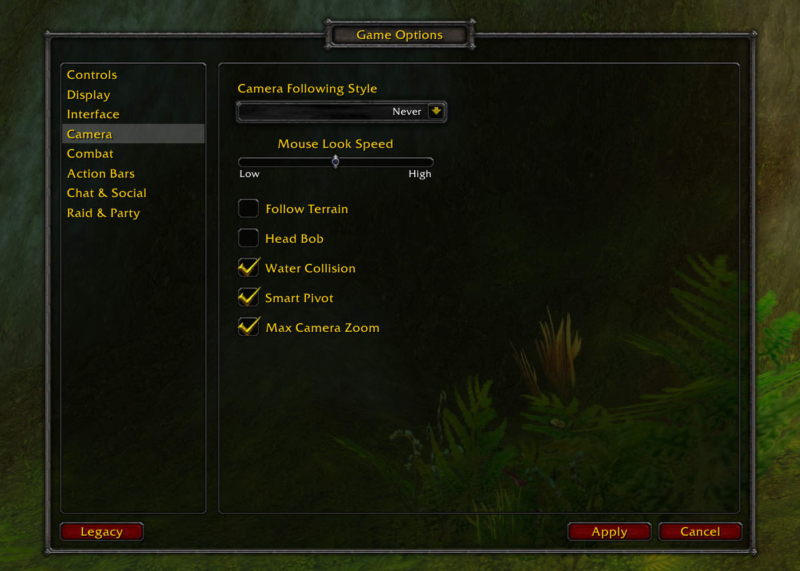
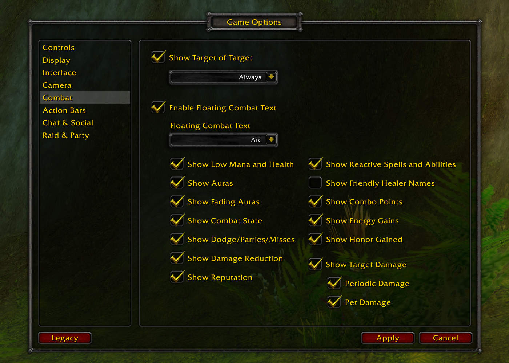
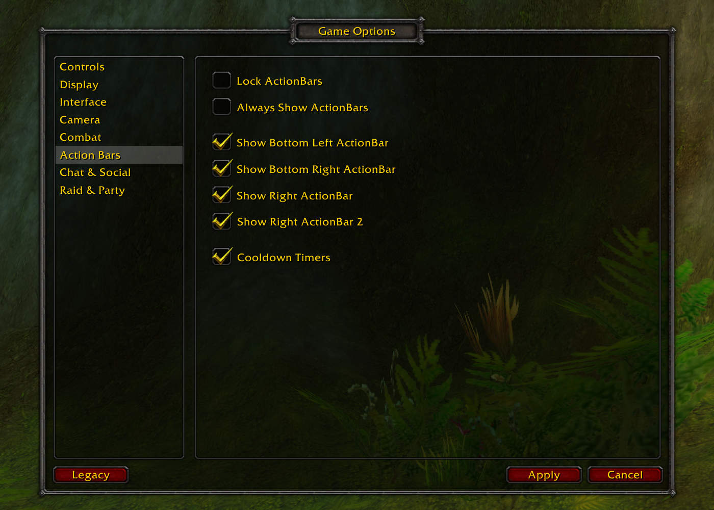
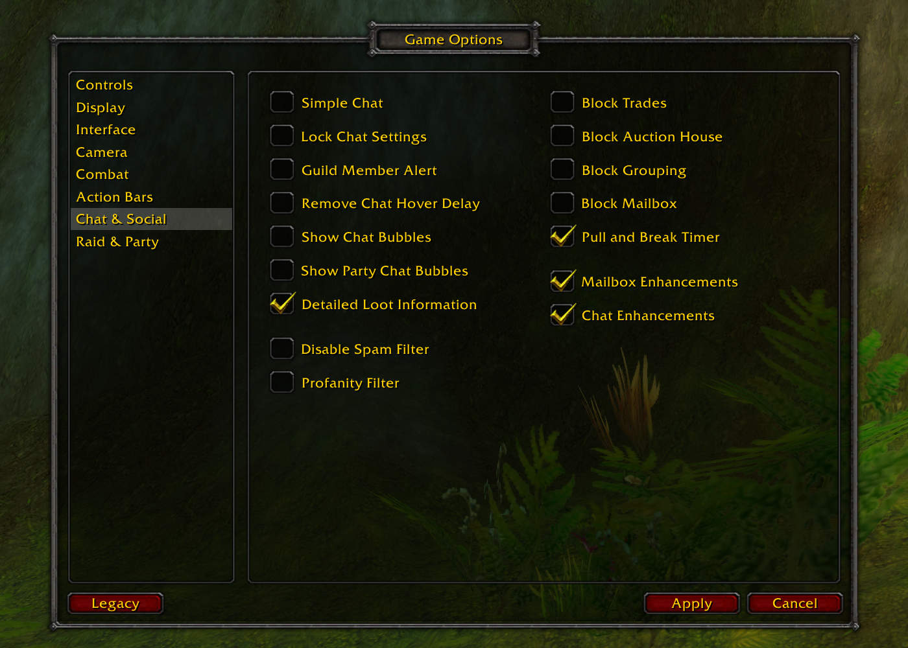
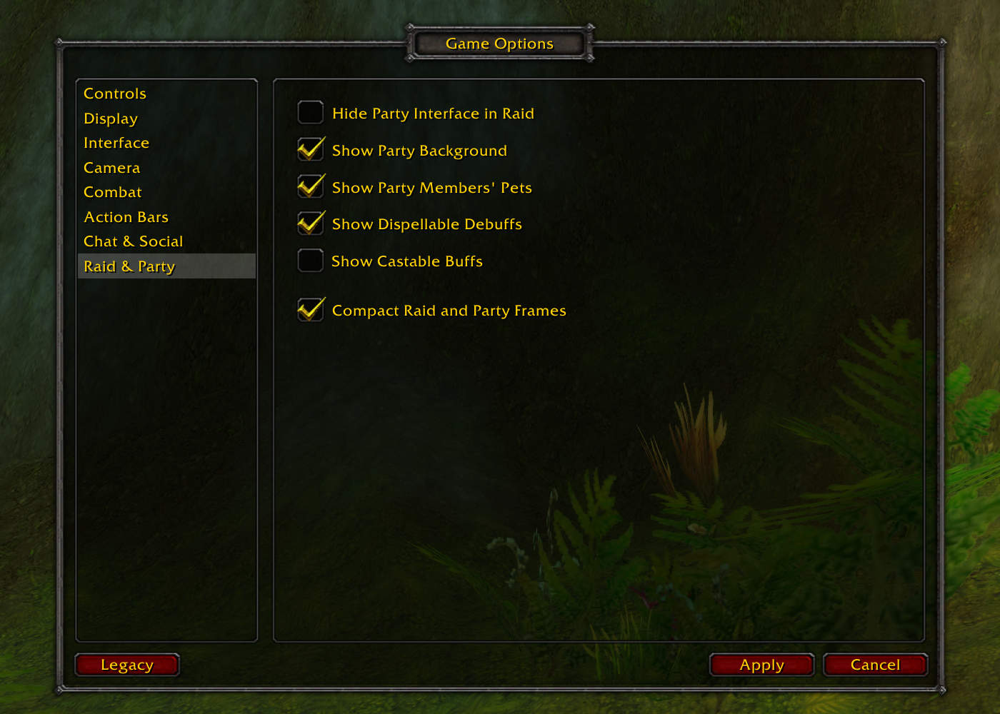

# Vanilla Game Options

TBC style Interface Options panel with additional tweaks for World of Warcraft
Client v1.12.

> [!IMPORTANT]
> This was tested with Turtle WoW Client which is a bit modified so it may not
> work properly on clean 1.12 client.

> [!IMPORTANT]
> None of the additional tweaks are enabled by default so you will have to
> enable them yourself. This is because some of the might conflict with your
> existing addons.

> [!IMPORTANT]
> Some of the modules rely on
> [SuperWoW](https://github.com/balakethelock/SuperWoW) to work properly so
> make sure you also have that installed.

Introduces a replacement for Interface Options and adds additional tweaks:

- Align Grid
- Auction Enhancements
- Aura Tracker
- Auto Loot
- Auto Repair
- Auto Sell
- Bag Search
- Bank Bags
- Big Player Frame
- Block Auction House
- Block Grouping
- Block Mailbox
- Bulletin Board
- Casting Bar Position
- Chat Enhancements
- Combat Cursor
- Compact Action Bars
- Compact Frames
- Compact Frames
- Compare Tooltip
- Cooldown Timers
- Druid Mana Bar
- Energy Mana Tick
- Enhanced Aura Buttons
- Event Trace
- Extended Commands
- Frame Stack
- Free Bag Slots
- Hide BGF
- Hide EBC
- Hide LFT
- Hide Errors
- Hunter Target Distance
- Item Level
- Last Message Only
- Low Health
- Mailbox Enhancements
- Maintain Druid Forms
- Maintain Hunter Aspects
- Mana Bar Color
- Max Camera Zoom
- Minimap Clock
- Mini Player Frame
- Mini Power Frame
- Nameplate Combo Points
- Nameplate Scaling
- Nameplate Threat
- Nearby Targets
- Out Of Range
- Pull Break Timer
- Rested XP Tooltip
- Solo Self Found
- Target Casting Bar
- Target Change Stop Attack
- Travel Journal
- Trinket Manager

## Settings panels











## Some of the features

### Compact Action Bars


### Mini Player Frame


## Game sounds alterations

In directory `GameSounds` are overrides for some of the internal game sounds
like Gun sound and Error sound. Copy `Sound` directory to the root of WoW and
it will replace the sounds.

You can choose which ones you want to replace by choosing those folders.

The structure should look like this.

```
WoW/
  WoW.exe
  Sound/
    Item/
      Weapons/
        Gun/     -> Replaces gun sounds with more pleasent ones.
    Spells/
      Fizzle/    -> Mutes all the error sounds.
```

## Game MPQ

In `GameAssets/Data` copy `patch-O.mpq` to Data folder in WoW directory.
This patch adds circles around mobs when AOE etc.

