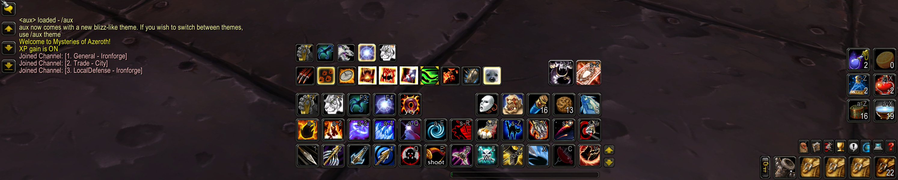
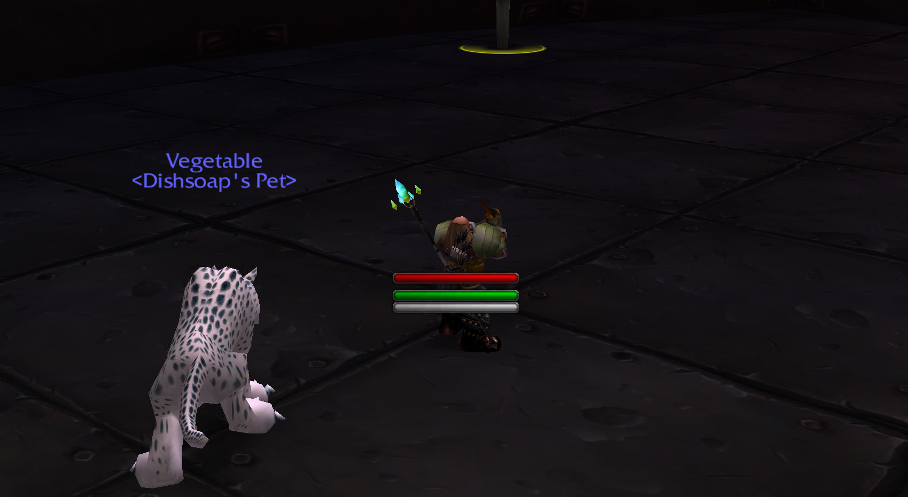
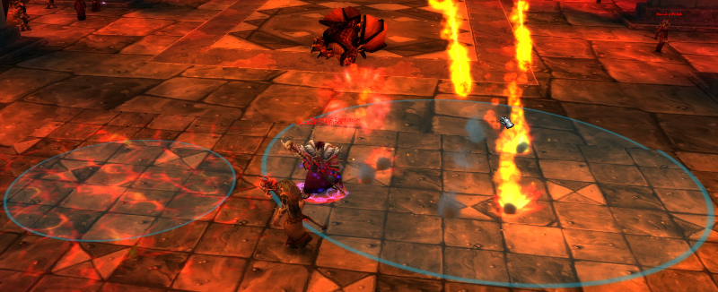

# Vanilla Enhanced

Preserves the original Vanilla UI with modern enhancements and quality-of-life improvements.
Compatible with World of Warcraft Client v1.12.

> [!IMPORTANT]
> This was tested with the Turtle WoW Client, which is modified. It may not work properly on a clean 1.12 client.

> [!IMPORTANT]
> None of the additional tweaks are enabled by default. You must enable them manually to avoid conflicts with existing addons.

> [!IMPORTANT]
> Some modules require [SuperWoW](https://github.com/balakethetlock/SuperWoW) to function correctly.

## Feature Descriptions

### UI Enhancements
- **Big Player Frame**: Enhances player and target unit frames with larger health bars and optional class-colored status bars.
- **Compact Action Bars**: A complete UI overhaul that stacks action bars vertically, repositions bags/micro-menu buttons, and removes Blizzard art for a cleaner look.
- **Compact Raid and Party Frames**: Modernized health-bar-style frames with heal prediction, range detection, and debuff highlighting.
- **Mini Player & Power Frames**: Standalone, combat-only frames for tracking player health, power (Mana/Rage/Energy), and combo points near the center of the screen.
- **Mana Bar Color & Ticks**: Changes the mana bar to white for better visibility and adds a "spark" to track the 2-second regeneration cycle.
- **Enhanced Aura Buttons**: Expands the player buff frame to support up to 32 buffs and 16 debuffs with countdown timers and stack counts.
- **Minimap Clock & Stopwatch**: Adds local/server time to the minimap and a built-in stopwatch feature.
- **Align Grid**: Draws a reference grid (Ctrl+Alt+Shift) to help you align UI elements perfectly.

### Combat & Gameplay
- **Target Casting Bar**: Displays the name and progress of the spell your current target is casting directly on their unit frame.
- **Cooldown Timers**: Adds numerical countdowns and icon desaturation to abilities and items on cooldown.
- **Nameplate Enhancements**: Adds combo points, scaling based on UI settings, and threat-based coloring (green when you have aggro) to nameplates.
- **Out of Range Indicator**: Colors action button icons red when your target is out of range for that specific spell.
- **Hunter Target Distance**: A specialized indicator for Hunters showing Melee, Ranged, Deadzone, or Out of Range status.
- **Druid Specifics**: Smart rotation macro (`/dob`), mana bar visibility while shapeshifted, and form-switch spam protection.
- **Pull & Break Timer**: Compatible with BigWigs to show countdown bars for raid pulls and breaks.

### Automation & Quality of Life
- **Auction Enhancements**: Adds a "Post" tab to the AH with automated stack splitting, price scanning, and bulk posting.
- **Auto Loot/Repair/Sell**: Automates looting (via Shift), gear repairs at merchants, and selling of junk (grey) items.
- **Mailbox Enhancements**: Remembers the last recipient and adds Shift+Click to quickly take items and delete mail.
- **Bag & Item Tools**: Adds a search box to the backpack, shows free slot counts, displays item levels/rarity on gear icons, and adds quest progress to tooltips.
- **Bank Bags**: Allows you to view a snapshot of your bank contents even when you are not at a bank.
- **Consumables Panel**: A dedicated 6x6 grid that automatically finds and displays all consumable items in your bags.
- **Trinket Manager**: A small frame for managing equipped trinkets and relics, including cooldown tracking and easy usage.

### World & Map
- **World Map Markers**: Adds persistent icons for Dungeons, Raids, Flight Paths, Transports, and World Bosses to the world map.
- **Travel Journal**: Allows you to place custom pins and notes on the world map (Ctrl+Click) to track your discoveries.
- **Max Camera Zoom**: Increases the maximum distance you can zoom out (toggleable with `/mz`).

### Utility & Challenges
- **Bulletin Board**: Automatically parses chat channels for LFG/LFM messages and lists them in a filterable UI categorized by dungeon.
- **Extended Commands**: Adds modern slash commands like `/rl` (reload), `/use`, `/dismount`, and `/cancelform`.
- **Solo Self Found**: A challenge mode module that blocks grouping, trading, and auction house usage.
- **Hide UI Elements**: Specialized modules to hide Lua errors and specific Minimap buttons (BGF, LFT, EBC).

## UI Preview

The addon introduces a TBC-style Interface Options panel accessible via the main menu.


### Compact Action Bars


### Mini Player Frame


## Manual Tweaks

### Game Sounds
The `GameSounds` directory contains overrides for internal game sounds (e.g., Gun sounds, Error sounds). To install, copy the `Sound` directory to your WoW root folder.

```
WoW/
  WoW.exe
  Sound/
    Item/
      Weapons/
        Gun/     -> Replaces gun sounds.
    Spells/
      Fizzle/    -> Mutes error sounds.
```

### Game AOE MPQ



Copy `GameAssets/Data/patch-O.mpq` to the `Data` folder in your WoW directory. This patch adds visual indicators (circles) around mobs during AOE.

https://github.com/MarcelineVQ/twow-raid-visuals
